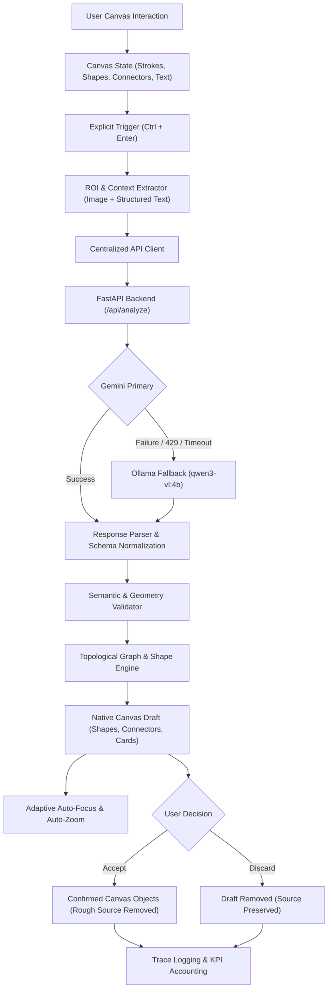

# Project SLATE — AI Canvas

An AI-native infinite whiteboard combining low-latency visual sketching with deep multimodal understanding and structured generative canvas transformations.

The application allows users to draw, type, create native shapes and connectors, solve handwritten mathematics, clean up rough sketches into vector primitives, and dynamically generate complex structured diagrams (flowcharts, architecture graphs, state machines) directly on the whiteboard canvas.

```text
ai-canvas/
├── frontend/     React + TypeScript + Vite interactive infinite canvas
├── backend/      FastAPI service: ROI extraction → Gemini Primary / Ollama Fallback → Normalized AI Draft
├── benchmarks/   Benchmark canvas documents for evaluation
├── traces/       JSONL telemetry and trace logs (≥50 real records)
├── docs/         In-depth technical architecture and metrics documentation
└── scripts/      Benchmark creation and automated evaluation harness
```

---

## Key Features

### 1. High-Performance Infinite Canvas Core
- **Sparse Multi-Layer Scene**: Smooth 60fps rendering of hand-drawn strokes (pen, pencil, highlighter with pressure/tilt), vector shapes (rectangles, rounded rectangles, circles, diamonds, triangles), orthogonal & straight connectors with arrowheads, and inline text objects.
- **Direct In-Canvas Text Tool**: Click-to-place caret autofocus at exact world coordinates, live typing synchronization, dynamic auto-growing sizing, and seamless click-to-edit for existing text objects.
- **Manipulation & Geometry**: Marquee and click selection, multi-object drag, 8-handle uniform & directional resizing, stroke & object eraser, and unified undo/redo history covering both user edits and AI draft lifecycle actions.
- **Infinite Navigation**: Sub-pixel pan (middle-mouse / space-drag), cursor-anchored zoom (0.1x to 5.0x), and spatial culling tested up to 5,000+ objects.
- **Persistence & Export**: Schema-validated JSON document save/load with auto-save in `localStorage`, and content-bounded high-resolution PNG export.

### 2. Multimodal AI Pipeline
- **Hybrid Provider Architecture**:
  - **PRIMARY Provider**: Google Gemini (`gemini-3.6-flash`) for rapid, high-accuracy multimodal vision and structured JSON synthesis.
  - **FALLBACK Provider**: Local Ollama (`qwen3-vl:4b`) with automatic failover if cloud network or quota errors occur.
- **Explicit `Ctrl + Enter` Deterministic Trigger**:
  - AI analysis runs strictly when the user explicitly triggers it via `Ctrl + Enter` (or `Cmd + Enter`).
  - Completely eliminates unwanted background idle generation, accidental token consumption, and distraction while actively drawing or typing.
- **Full-Scene ROI Extraction**:
  - Automatically identifies active user context: selection → recent edits (strokes, text, shapes) → viewport world bounds.
  - Renders relevant strokes, native shapes, and typed text to an offscreen buffer while forwarding structured canvas text directly to the model.
- **Dynamic Content & Structured Vector Generation**:
  - **Math Equations**: Formulates step-by-step mathematical derivations formatted in LaTeX via KaTeX.
  - **Factual & Contextual Inquiries**: Generates clean, concise Markdown note cards.
  - **Shape Cleanup**: Detects rough hand-drawn shapes and generates clean native vector replacements.
  - **Complex Diagrams & Workflows**: Generates multi-node topological diagrams (flowcharts, pipelines, state machines) routed with native connectors and layout constraints.
- **Native Draft Lifecycle**:
  - AI outputs appear as movable, editable draft objects on the canvas with an intuitive **Accept / Discard** action bar.
  - **Source Replacement**: Accepting a cleaned shape or diagram atomically confirms the AI vector objects and removes the rough source drawing in one undoable step.
- **Adaptive Auto-Focus & Auto-Zoom**:
  - Calculates the exact composite bounding box across all generated result objects.
  - Smoothly centers and zooms the camera with responsive padding (`paddingFraction = 0.18`) so the complete output fits within the viewport.
- **Comprehensive Instrumentation**:
  - Granular segment-level latency timing (`t_capture`, `t_dispatch`, `ttfb`, `ttft`, `t_stream`, `e2e`).
  - Token and rate-table cost accounting logged to durable JSONL traces (`traces/traces.jsonl`).
  - Live session KPI calculation: Cost Per Accepted Draft (**CPAD**), Draft Acceptance Rate (**DAR**), Wasted Token Ratio (**WTR**), and Benchmark Coverage (**BC**).

---

## Architecture Overview



---

## Quick Start

### Prerequisites
- **Node.js**: v18+ (tested on v20+)
- **Python**: 3.10+ (tested on Python 3.13)
- **Google Gemini API Key** (optional, recommended for primary provider)
- **Ollama** (optional, for local fallback): [ollama.com](https://ollama.com) with `qwen3-vl:4b`

### 1. Backend Setup

```bash
cd backend
python -m venv .venv
# On Windows:
.venv\Scripts\activate
# On macOS/Linux:
# source .venv/bin/activate

pip install -r requirements.txt
cp .env.example .env

# Edit .env and configure your GEMINI_API_KEY if available:
# GEMINI_API_KEY="your_api_key_here"
# GEMINI_MODEL="gemini-3.6-flash"

uvicorn app.main:app --reload --port 8000
```

Verify backend health at `http://localhost:8000/health`.

### 2. Frontend Setup

```bash
cd frontend
npm install
cp .env.example .env
npm run dev
```

Open `http://localhost:5173` in your browser.

---

## Keyboard Shortcuts

| Shortcut | Tool / Action |
| :--- | :--- |
| `P` / `B` / `H` | Pen / Pencil / Highlighter |
| `E` / `V` / `X` | Eraser / Select / Text Tool |
| `R` / `O` / `T` / `D` | Rectangle / Circle / Triangle / Diamond |
| `A` | Connector / Arrow Tool |
| `Space` + Drag / Middle Mouse | Infinite Canvas Pan |
| `Scroll` / `Pinch` | Cursor-Anchored Zoom |
| `Ctrl`/`Cmd` + `Z` | Undo |
| `Ctrl`/`Cmd` + `Shift` + `Z` (or `Ctrl`/`Cmd` + `Y`) | Redo |
| `Delete` / `Backspace` | Delete selected objects |
| `Ctrl`/`Cmd` + `S` / `O` / `E` | Save Canvas / Load Canvas / Export PNG |
| **`Ctrl`/`Cmd` + `Enter`** | **Analyze Canvas with AI (Explicit Trigger)** |
| `Ctrl`/`Cmd` + `Shift` + `M` | Toggle AI Metrics & KPI Panel |
| `?` | Toggle Shortcut Cheat Sheet |

---

## Test Suite Execution

All test suites have been verified with 100% passing tests:

```bash
# Run Frontend Tests (72 Unit Tests across 11 Test Suites)
cd frontend
npm test

# Typecheck Frontend TypeScript (0 errors)
npx tsc --noEmit

# Run Backend Tests (54 Unit Tests)
cd backend
pytest -v
```

---

## Known Limitations

1. **Non-Streaming Provider Execution**: Gemini and Ollama responses currently arrive as complete structured JSON bodies; `ttft` matches `ttfb` and `t_stream` is logged as 0ms.
2. **DOM-Based LaTeX/Markdown Cards**: While native shapes, diagrams, and text are drawn on canvas layers, Rich Markdown/LaTeX answer cards render via an overlay layer with KaTeX for selection and math formatting.
3. **Spatial Index Threshold**: Viewport culling uses a linear bounding box filter optimized for up to 5,000–10,000 elements; beyond that scale, an R-tree spatial index would be beneficial.

---

## Documentation Index

- [CANVAS_ARCHITECTURE.md](docs/CANVAS_ARCHITECTURE.md) — Coordinate transforms, spatial math, rendering scheduler, and undo/redo architecture.
- [AI_INTEGRATION.md](docs/AI_INTEGRATION.md) — Multimodal context extraction, prompt engineering, provider routing, and draft lifecycles.
- [METRICS.md](docs/METRICS.md) — Latency segmentation, token accounting, rate tables, KPI definitions, and trace schema.
- [REPORT.md](REPORT.md) — Empirical benchmark evaluation, latency distribution, optimization analysis, and trade-off comparisons.
- [IDEAS.md](IDEAS.md) — 10 original canvas-native product proposals and detailed design for the shipped Topological Diagram Engine.
- [ATTRIBUTION.md](ATTRIBUTION.md) — Third-party licenses, models, and reference project acknowledgments.
- [AI_USAGE.md](AI_USAGE.md) — Full disclosure of AI assistant usage, debugging trajectories, and manual verification steps.
