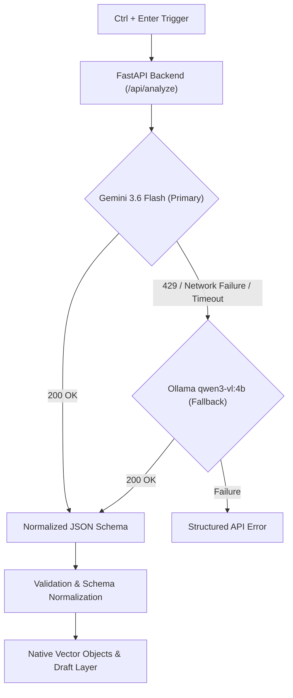

# AI Integration Architecture

This document details the multimodal AI pipeline built on top of the structured canvas foundation: Region-of-Interest (ROI) extraction → Gemini Primary / Ollama Fallback routing → Schema normalization → Topological diagram engine → Native canvas drafts.

---

## 1. Hybrid Provider Architecture (Gemini Primary + Ollama Fallback)

The AI backend implements a robust, fault-tolerant provider abstraction (`backend/app/ai/`):

### Routing Strategy
- **Google Gemini (`gemini-3.6-flash`)**: Primary cloud runtime offering fast multimodal latency (~900ms $p_{50}$), rich reasoning, and strict structured JSON generation. Configured with deterministic sampling (`temperature=0.1`, `top_p=0.9`) and `automatic_function_calling=types.AutomaticFunctionCallingConfig(disable=True)`.
- **Local Ollama (`qwen3-vl:4b`)**: Offline fallback activated automatically if Gemini quota is exhausted (HTTP 429), the API key is unconfigured, or cloud network errors occur. Ollama is **never** called in parallel or redundantly after a successful Gemini response.

---

## 2. Deterministic AI Trigger Model (`Ctrl + Enter`)

AI analysis is strictly controlled by explicit user intent:

- **Hotkey Trigger**: `Ctrl + Enter` (or `Cmd + Enter`).
- **Rationale**: Multimodal vision requests are computationally and financially significant. Automatic idle-pause timers created unwanted interruptions, duplicate token costs during drawing pauses, and ungrounded hallucinations on incomplete sketches.
- **Empty Canvas Guard**: Pressing `Ctrl + Enter` with no meaningful canvas content displays `"Add something to the canvas before analyzing."` without sending empty payloads.
- **Synchronous Context Commit**: If the user is typing in the in-canvas Text tool, pressing `Ctrl + Enter` synchronously flushes the live textarea value into `useCanvasStore.textObjects` and passes the latest text directly to the analysis pipeline in the same tick.

---

## 3. Full-Scene ROI & Context Extraction

`RegionExtractor.ts` computes the optimal visual and semantic region without rasterizing massive blank canvas areas:

1. **Context Hierarchy**:
   - `Selection`: If the user has selected objects, the bounding box of the selection defines the ROI.
   - `Recent Edits`: If unselected, dirty strokes, recent text, and shapes define the ROI.
   - `Viewport World Bounds`: Fallback to current camera framing.
2. **Multi-Layer Offscreen Rasterization**:
   - Renders vector shapes, connectors, strokes, and typed text to an offscreen HTML5 canvas buffer at `1024px` resolution with `48px` padding.
   - Forwards structured `canvasTexts` as pure JSON strings alongside the visual bitmap, providing the model with grounded typed text and visual spatial layout simultaneously.

---

## 4. Output Types & Topological Graph Engine

The AI pipeline produces three distinct output categories:

### A. Mathematical Derivations & Explanations (`contentType: "latex"`)
- Formatted step-by-step mathematical solutions rendered on the canvas via KaTeX.

### B. Contextual Q&A & Notes (`contentType: "markdown"`)
- Structured Markdown cards sanitized with DOMPurify and rendered with Marked.

### C. Native Vector Shapes & Multi-Node Diagrams (`contentType: "diagram" | "shape"`)
- **Node-and-Edge Synthesis**: Multimodal AI emits semantic graph definitions with node labels, shape types (rectangle, rounded-rectangle, circle, diamond, triangle), and directed edge relationships.
- **Topological Layout Engine (`LayoutEngine.ts`)**: Automatically computes collision-free bounding boxes, topological tiers, and orthogonal connector routes.
- **Native Canvas Integration**: Generated objects are native vector shapes (`CanvasShape`) and connectors (`CanvasConnector`), not static PNG images.

---

## 5. Draft Lifecycle & Atomic Source Replacement

Every AI output enters a structured lifecycle:

1. **Draft State**: Rendered with glowing dashed borders and a floating action bar (**Accept** / **Discard**).
2. **Accept Action**:
   - For Cleaned Shapes and Flowcharts: Confirms the clean vector objects and atomically removes the original rough hand-drawn source strokes.
   - Undoing (`Ctrl + Z`) the acceptance restores the original rough strokes and reverts the draft.
3. **Discard Action**:
   - Removes the AI draft objects while preserving the original user strokes intact.

---

## 6. Adaptive Auto-Focus & Auto-Zoom

Upon generation, `Camera.ts::calculateFocusCamera()`:
- Calculates the unified composite bounding box across all generated result objects.
- Adds adaptive viewport padding (`paddingFraction = 0.18`).
- Computes `fitZoom = clamp(Math.min(availW / contentW, availH / contentH), 0.6, 1.2)` and smoothly centers the result within the viewport.
